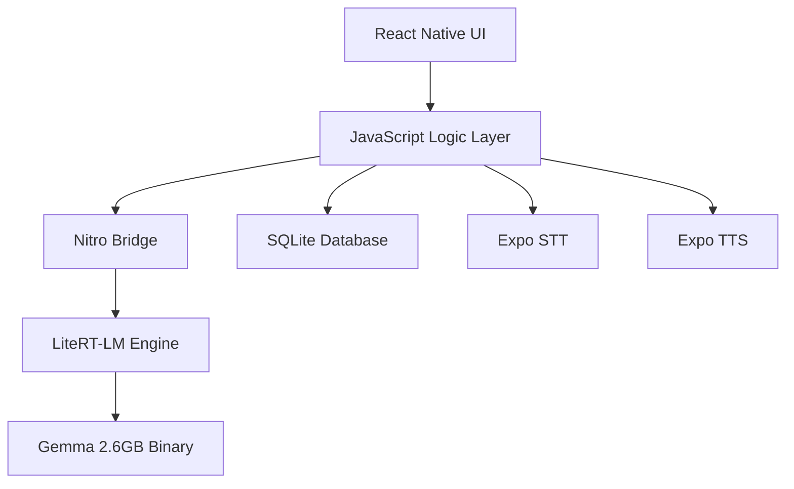

# Engineering Design Document: Ledger Offline-First AI Financial Assistant

## 1. System Overview

Ledger is a privacy-centric, offline-first financial assistant designed for users with low connectivity and low literacy. It leverages high-performance on-device LLMs (Gemma 4) to provide natural language transaction tracking and queries without any cloud dependency.

## 2. Technical Stack

| Layer | Technology |
|-------|------------|
| **Core Framework** | React Native (Expo SDK 55+) |
| **Language** | TypeScript (Frontend), Kotlin 2.3.0 (Native) |
| **Build System** | Gradle 8.10.2 / Android SDK 36 / JDK 21 |
| **Database** | SQLite (expo-sqlite) with FTS5 for search |
| **AI Inference** | LiteRT-LM (Nitro Module) |
| **LLM Model** | Gemma 4 2B E2B (4-bit quantized) |
| **Speech-to-Text** | Expo Speech Recognition (On-Device) |
| **Text-to-Speech** | Expo Speech (System Native) |

## 3. Architecture Design

### 3.1 Component Diagram

### 3.2 Data Flow: Voice to Ledger

1. **Audio Capture**: User speaks into the microphone.
2. **STT Conversion**: `Expo Speech Recognition` processes audio into raw text locally.
3. **Prompt Engineering**: The text is wrapped in a system prompt defining transaction categories and JSON schema.
4. **LLM Extraction**: Gemma 4 extracts `amount`, `type`, `category`, and `counterparty`.
5. **Validation**: JavaScript validates the extraction and deduplicates against the last 5 minutes of entries.
6. **Persistence**: The structured record is saved to the SQLite `events` table.

## 4. Native Integration (The Nitro Bridge)

To achieve near-native performance for a 2.6B parameter model, Ledger uses **Nitro Modules**. This bypasses the traditional React Native JSON bridge, providing direct C++ memory access.

### 4.1 Native Configuration
- **Architecture**: Enforced `arm64-v8a` to support LiteRT SIMD optimizations.
- **Packaging**: `extractNativeLibs="true"` to prevent mmap failures on large binaries.
- **Kotlin**: Locked to `2.3.0` to ensure compatibility with modern AI library metadata.

## 5. Memory & Performance Management

### 5.1 Memory Strategy (8GB Target)
- **Lazy Loading**: The Gemma model is only loaded when the `isGemmaDownloaded` flag is true and the UI enters the "Listening" state.
- **Pre-warming**: A minimal "warm-up" prompt is sent after loading to ensure GPU/CPU buffers are initialized.
- **GC Management**: Explicit reference nulling in the Nitro layer after heavy inference tasks.

### 5.2 Storage Strategy
- **Google Play Asset Delivery**: The 2.6GB model is handled as a separate asset pack to keep the base APK size under 100MB.
- **SQLite FTS5**: All transaction descriptions are indexed for sub-10ms natural language search.

## 6. Security & Privacy

### 6.1 Data Sandbox
- **Zero Internet Permission**: The app manifest explicitly omits `INTERNET` permissions (except in debug builds).
- **Encryption at Rest**: Databases are stored in the application's private sandbox, protected by Android's file-based encryption.

### 6.2 Model Integrity
- **Checksum Verification**: Models are verified against a SHA-256 hash before loading to prevent binary tampering.

## 7. Natural Language Query (NLQ) Engine

Ledger translates user questions directly into SQL `WHERE` clauses.

**Example Flow:**
- *User:* "How much did I spend on rice this month?"
- *Gemma:* `type = 'expense' AND (category = 'food' OR description LIKE '%rice%') AND timestamp >= start_of_month`
- *Engine:* Executes SQL and returns result to Gemma for natural language summarization.
