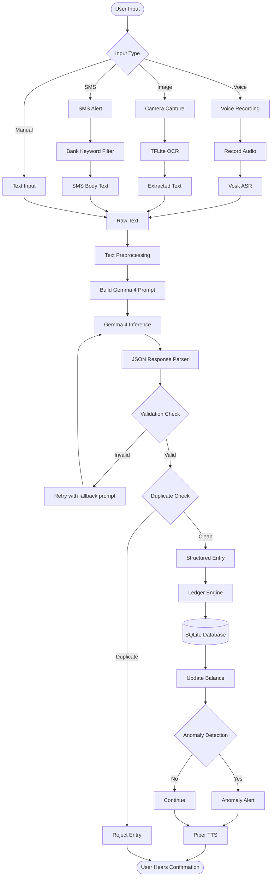
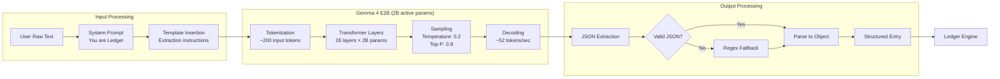
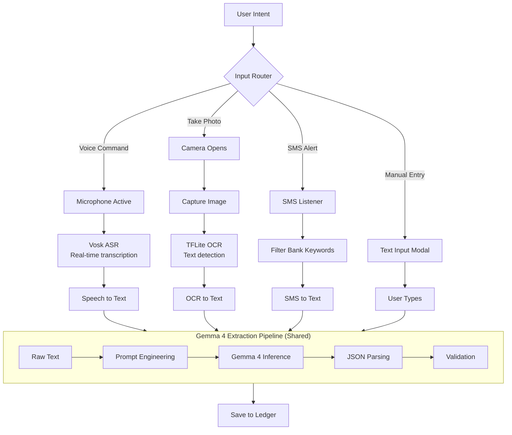
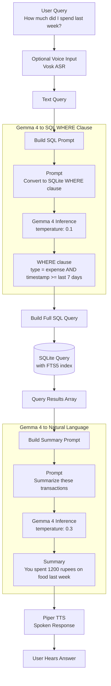
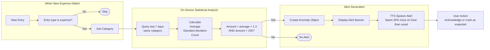
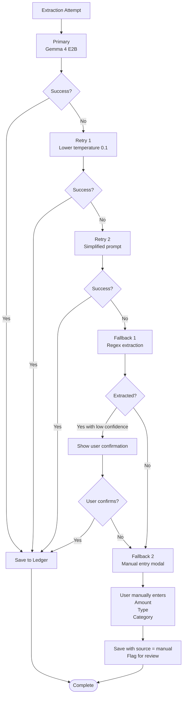
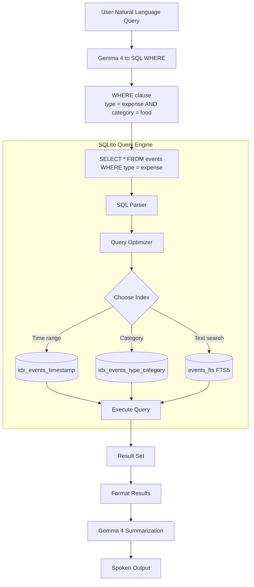
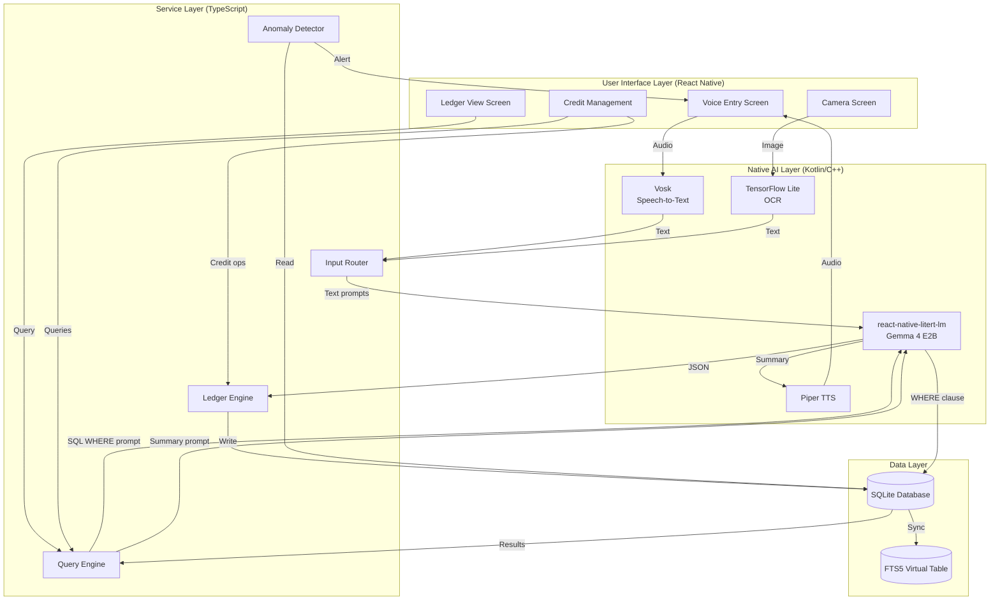

# Ledger AI Workflow - Mermaid Diagrams

Here are the complete workflow diagrams for Ledger's AI processing pipeline, from user input to database storage.

---

## 1. Complete End-to-End AI Workflow



---

## 2. Detailed Gemma 4 E2B Processing Pipeline



---

## 3. Multimodal Input Routing



---

## 4. Natural Language Query Processing



---

## 5. Anomaly Detection Flow



---

## 6. Credit Customer Tracking Workflow

```mermaid
flowchart TD

    subgraph AddCustomer["Add Credit Customer"]
        Voice1["Add customer Ramesh"]
            --> ASR1[Vosk ASR]

        ASR1 --> Extract1["Gemma 4 extraction"]

        Extract1 --> Customer[(credit_customers table)]
    end

    subgraph RecordDebt["Record Debt"]
        Voice2["Ramesh bought 200 rice on credit"]
            --> ASR2[Vosk ASR]

        ASR2 --> Extract2["Gemma 4 extraction<br/>amount: 200<br/>customer: Ramesh"]

        Extract2 --> Lookup{Find Customer ID}

        Lookup -->|Found| CreateDebt["Insert credit transaction"]

        Lookup -->|Not Found| Prompt["Ask user to add customer first"]

        CreateDebt --> UpdateOwed["Update customer total owed"]
    end

    subgraph RecordPayment["Record Payment"]
        Voice3["Ramesh paid 200"]
            --> ASR3[Vosk ASR]

        ASR3 --> Extract3["Gemma 4 extraction"]

        Extract3 --> MarkPaid["Update transaction status to paid"]

        MarkPaid --> UpdatePaid["Update total paid and total owed"]
    end

    subgraph Query["Query Credit"]
        Voice4["How much does Ramesh owe?"]
            --> ASR4[Vosk ASR]

        ASR4 --> QueryDB["Select total owed from customer"]

        QueryDB --> TTS["Spoken Response<br/>Ramesh owes 200 rupees"]
    end
```



---

## 7. Model Loading & Memory Management

```mermaid
flowchart TD

    Start([App Launch]) --> CheckModel{Model Downloaded?}

    CheckModel -->|No| Download["Download from Play Asset Delivery<br/>2.58 GB Gemma 4 E2B task file"]

    Download --> ShowProgress["Show Progress Bar<br/>Resume on interrupt"]

    ShowProgress --> WaitDownload["Wait for completion<br/>Recommend WiFi"]

    CheckModel -->|Yes| LoadModels

    WaitDownload --> LoadModels

    subgraph LoadModels["Model Loading Sequence"]
        LoadModels --> LoadGemma["Load Gemma 4 E2B<br/>react-native-litert-lm"]

        LoadGemma --> LoadVosk["Load Vosk ASR<br/>50 MB model"]

        LoadVosk --> LoadOCR["Load TFLite OCR<br/>3 MB model"]

        LoadOCR --> LoadTTS["Load Piper TTS<br/>5 MB model"]
    end

    LoadTTS --> WarmUp["Pre-warm Gemma 4<br/>Send minimal prompt"]

    WarmUp --> Ready["App Ready<br/>Total RAM approximately 1.5 GB"]

    Ready --> UserInteraction[User Interaction]

    UserInteraction --> Monitor{Memory Monitor}

    Monitor -->|RSS > 1.4 GB| Warning["Show memory warning<br/>Suggest restart"]

    Monitor -->|Normal| Continue[Continue]

    Warning --> UserRestart{User restarts?}

    UserRestart -->|Yes| Start

    UserRestart -->|No| Continue
```

---

## 8. Fallback & Error Recovery Chain



---

## 9. Database Query Execution with FTS5



---

## 10. Complete System Component Interaction




These diagrams represent the complete AI workflow for Ledger. The key architectural decisions visualized include:

1. **Sequential processing** - Voice/Image/SMS all route through Gemma 4 for extraction
2. **Fallback chains** - Multiple retry strategies before manual entry
3. **Shared inference engine** - Gemma 4 handles both extraction AND query-to-SQL
4. **FTS5 for search** - SQLite's full-text search for fast natural language queries
5. **Anomaly detection** - Lightweight statistical analysis, no LLM needed
6. **Memory monitoring** - Critical for low-end device stability

Would you like me to create any additional diagrams for specific sub-systems, such as the Bluetooth backup flow or the credit readiness score calculation?